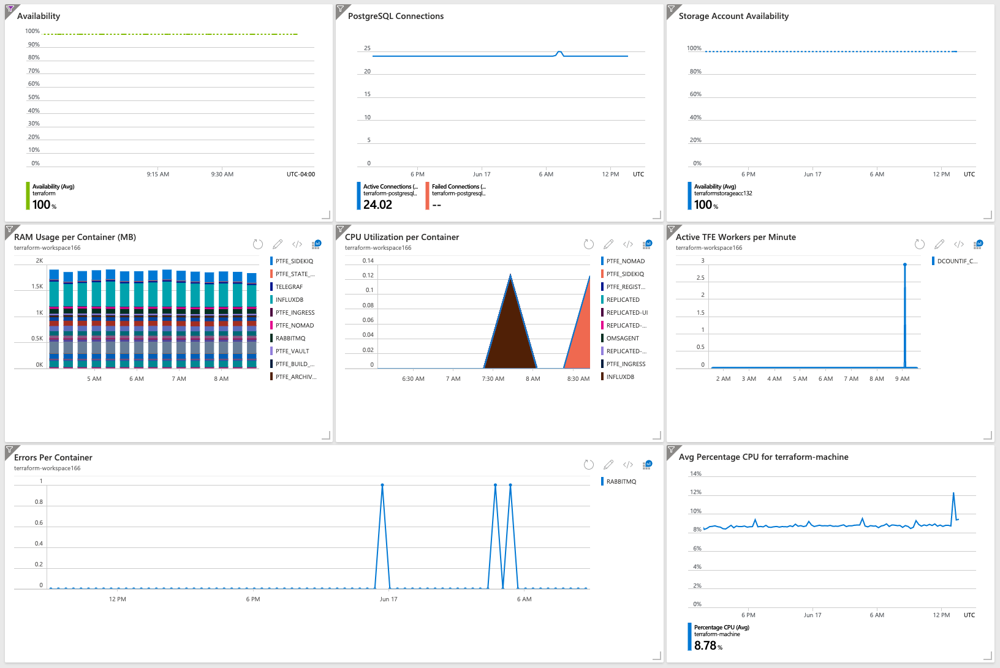

# Metrics

- Host CPU
- Host Memory
- Host Disk
- Containers CPU

```
Perf
| make-series avgif(CounterValue, CounterName == "% Processor Time"), default=0 on TimeGenerated from ago(3h) to now() step 20m by InstanceName
```

- Containers RAM

```
Perf
| make-series avgif(CounterValue, CounterName == "Memory Usage MB"), default=0 on TimeGenerated from ago(3h) to now() step 20m by InstanceName
```

- Errors over time

```
ContainerLog
| where Name == "replicated" and LogEntry contains "ERROR" or 
    Name == "replicated-premkit" and LogEntry contains "level=error" or 
    Name == "replicated-ui" and LogEntry contains "ERROR" or
    Name == "retraced-api" and LogEntry contains "\\\"level\\\":40" or
    Name == "retraced-processor" and LogEntry contains "\\\"level\\\":40" or
    Name == "replicated-statsd" and LogEntry contains "[ERROR]" or
    Name == "replicated-operator" and LogEntry contains "ERROR" or
    Name == "influxdb" and LogEntry contains "HTTP/1.1\\\" 500" or
    Name == "ptfe_ingress" and LogEntry contains "\\\"error\\\"" or
    Name == "ptfe_redis" and LogEntry contains "ERROR" or
    Name == "ptfe_state_parser" and LogEntry contains "[ERROR]" or
    Name == "rabbitmq" and LogEntry contains "[error]" or
    Name == "ptfe_backup_restore" and LogEntry contains "Error" or
    Name == "ptfe-health-check" and LogEntry contains "[ERROR]" or
    Name == "ptfe_nomad" and LogEntry contains "[ERROR]" or
    Name == "telegraf" and LogEntry contains "Error" or
    Name == "ptfe_nginx" and LogEntry contains "HTTP/1.1\\\" 500" or
    Name == "ptfe_vault" and LogEntry contains "[ERROR]" or
    Name == "ptfe_build_manager" and LogEntry contains "[ERROR]" or
    Name == "ptfe_archivist" and LogEntry contains "[ERROR]" or
    Name == "ptfe_sidekiq" and LogEntry contains "[ERROR]" or
    Name == "ptfe_atlas" and LogEntry contains "[ERROR]" or
    Name == "ptfe_registry_worker" and LogEntry contains "[ERROR]" or
    Name == "ptfe_registry_api" and LogEntry contains "[ERROR]"
| make-series count(), default=0 on TimeGenerated from ago(24h) to now() step 20m by Name
```

- Number of Active Workers

```
ContainerServiceLog
| where Image == "hashicorp/build-worker:now"
| make-series dcountif(ContainerID, Command != "destroy"), default=0 on TimeOfCommand from ago(5h) to now() step 1m
```

- Terraform Healthcheck

[Healtcheck Endpoint](https://www.terraform.io/docs/enterprise/admin/monitoring.html#health-check)

- SQL Healthcheck

Active vs. Failed Connections

- Blob Storage Healthcheck

Availability Chart

- Vault Healthcheck (Optional)