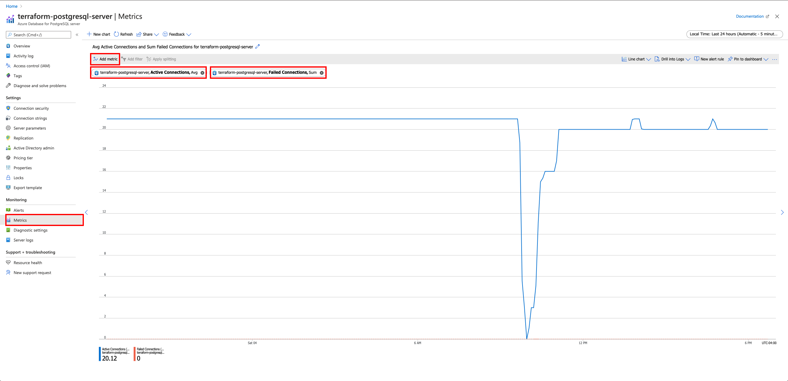
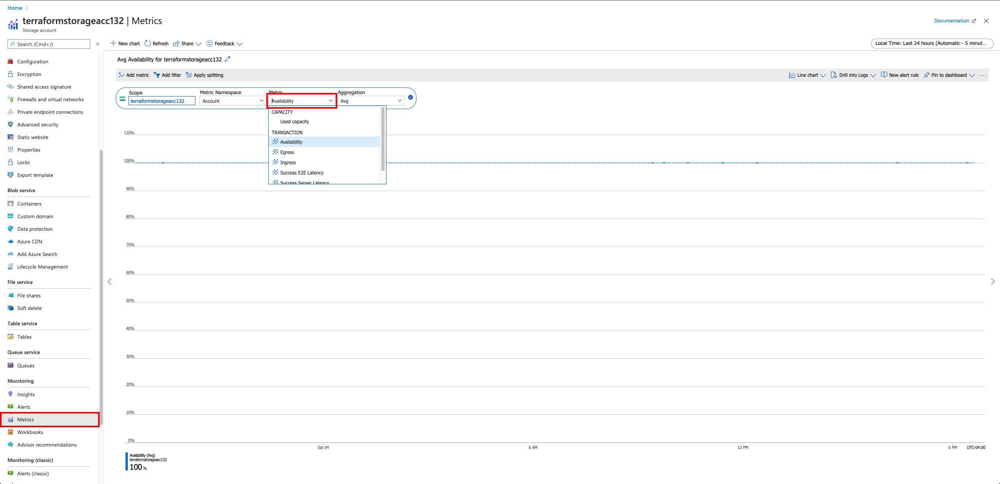

# Installation
1. Create a .tfvars file 

```
touch terraform.tfvars
```

2. Add license variable

```
license="license_key"
```

3. Apply Terraform

```
terraform init
terraform apply
```

# Metrics

After this point, I'm going to assume that you either have TFE installed already or are using the environment that is deployed using this automation. The next few sections cover the various log analytics queries used to query information reported by the OMS agent. 


## Log Collection

Terraform Enterprise runs entirely in docker containers. As a result, the most natural OMS Agent to utilize is the Docker variant as it can tap directly into the Docker logs socket rather than having to watch the container log files on disk. If you're looking to replicate this in your environment, the command below details how to start the OMS agent container. There are two parameters required for the OMS agent to function, and that is the Log Analytics Workspace ID and Workspace Key, which can be pulled from the Azure UI or CLI.

```
sudo docker run --privileged -d -v /var/run/docker.sock:/var/run/docker.sock -v /var/log:/var/log -v /var/lib/docker/containers:/var/lib/docker/containers -e WSID="${WORKSPACE_ID}" -e KEY="${WORKSPACE_KEY}" -p 127.0.0.1:25225:25225 -p 127.0.0.1:25224:25224/udp --name="omsagent" -h=`hostname` --restart=always microsoft/oms
```

## Metrics

- Host CPU
- Host Memory
- Host Disk

### Container CPU (Stacked Area Chart)

The Container CPU chart creates a time series dataset using the average CPU percentage over three hours and a twenty-minute interval. 

```
Perf
| make-series avgif(CounterValue, CounterName == "% Processor Time"), default=0 on TimeGenerated from ago(3h) to now() step 20m by InstanceName
```

### Container RAM (Stacked Bar Chart)

The Container RAM chart almost identical to the CPU chart, except that we utilize the Memory Usage metric. If you customize this query, ensure that you set these to the same period and interval so that the charts represent the same set of events.

```
Perf
| make-series avgif(CounterValue, CounterName == "Memory Usage MB"), default=0 on TimeGenerated from ago(3h) to now() step 20m by InstanceName
```

### Errors over time (Line Chart)

As we discussed, TFE is comprised of several different containers and services. As a result, the following Log Analytics Queries filter for each container by name and check for the corresponding ERROR level. Once we have the corresponding log entries, we split our dataset into a series over twenty-four hours and a twenty-minute interval.

```
ContainerLog
| where Name == "replicated" and LogEntry contains "ERROR" or 
    Name == "replicated-premkit" and LogEntry contains "level=error" or 
    Name == "replicated-ui" and LogEntry contains "ERROR" or
    Name == "retraced-api" and LogEntry contains "\\\"level\\\":40" or
    Name == "retraced-processor" and LogEntry contains "\\\"level\\\":40" or
    Name == "replicated-statsd" and LogEntry contains "[ERROR]" or
    Name == "replicated-operator" and LogEntry contains "ERROR" or
    Name == "influxdb" and LogEntry contains "HTTP/1.1\\\" 500" or
    Name == "ptfe_ingress" and LogEntry contains "\\\"error\\\"" or
    Name == "ptfe_redis" and LogEntry contains "ERROR" or
    Name == "ptfe_state_parser" and LogEntry contains "[ERROR]" or
    Name == "rabbitmq" and LogEntry contains "[error]" or
    Name == "ptfe_backup_restore" and LogEntry contains "Error" or
    Name == "ptfe-health-check" and LogEntry contains "[ERROR]" or
    Name == "ptfe_nomad" and LogEntry contains "[ERROR]" or
    Name == "telegraf" and LogEntry contains "Error" or
    Name == "ptfe_nginx" and LogEntry contains "HTTP/1.1\\\" 500" or
    Name == "ptfe_vault" and LogEntry contains "[ERROR]" or
    Name == "ptfe_build_manager" and LogEntry contains "[ERROR]" or
    Name == "ptfe_archivist" and LogEntry contains "[ERROR]" or
    Name == "ptfe_sidekiq" and LogEntry contains "[ERROR]" or
    Name == "ptfe_atlas" and LogEntry contains "[ERROR]" or
    Name == "ptfe_registry_worker" and LogEntry contains "[ERROR]" or
    Name == "ptfe_registry_api" and LogEntry contains "[ERROR]"
| make-series count(), default=0 on TimeGenerated from ago(24h) to now() step 20m by Name
```

### Number of Active Workers (Line Chart)

TFE has a few different containers that are used to process a "Run." As a result, we're utilizing the ContainerServiceLog, which tracks information about every container's executed commands. TFE utilizes Docker's random name generator to create containers for each Run that is executed. As a result, we need to filter the image being used, which happens to be the build-worker, and then group the log entries by the corresponding CopntainerID. Finally, we check each group for a resulting "destroy" command before splitting this data up into a series over a five-hour series and a one-minute interval. 

```
ContainerServiceLog
| where Image == "hashicorp/build-worker:now"
| make-series dcountif(ContainerID, Command != "destroy"), default=0 on TimeOfCommand from ago(5h) to now() step 1m
```

### Terraform Healthcheck 

[Terraform Healthcheck Endpoint](https://www.terraform.io/docs/enterprise/admin/monitoring.html#health-check)

Terraform includes a basic health check endpoint that returns a 200 OK status code if TFE is healthy. As a result, we can utilize Azure's Application Insights to set up a corresponding HTTP Health Check monitor that will poll TFE's health check endpoint on a specified frequency. The link below includes how to configure a URL Ping Test, enter the URL below, and adjust the frequency to match your requirements.

```
https://www.terraform_hostname_here.com/_health_check
```


[Creating am Azure URL Ping Test](https://docs.microsoft.com/en-us/azure/azure-monitor/app/monitor-web-app-availability#create-a-url-ping-test)


### Azure SQL Availability

Azure SQL DB's don't include a specific health check or availability metric that we can track. However, we can utilize the Active vs. Failed Connections metric as a stand-in. These metrics give us visibility into the health of the connection between TFE and out PostgreSQL DB, which provides us with the necessary information about whether or not we're experiencing an outage at the DB layer.



### Azure Blob Storage Availability

Azure Blog storage does include an availability metric that we can utilize to track the uptime of our blob storage backend. TFE uses Azure Blob storage to store state files, making it a critical component of the TFE architecture.



### Vault Healthcheck

If you're utilizing an external Vault cluster, Vault does include an HTTP health check endpoint. In the same way that we configure our TFE URL Ping Test, we can set up the Vault health check with Application Insights.

```
https://www.vault_hostname_here.com:8200/v1/sys/health
```

[Vault Healthcheck Endpoint](https://www.vaultproject.io/api-docs/system/health#sample-request)