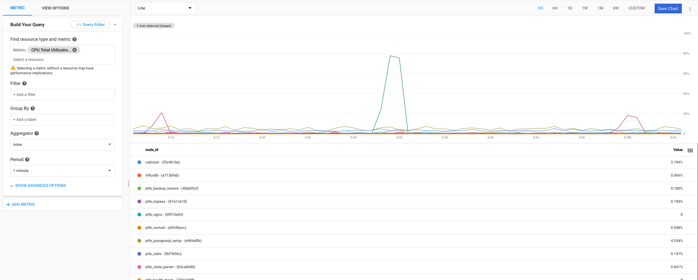
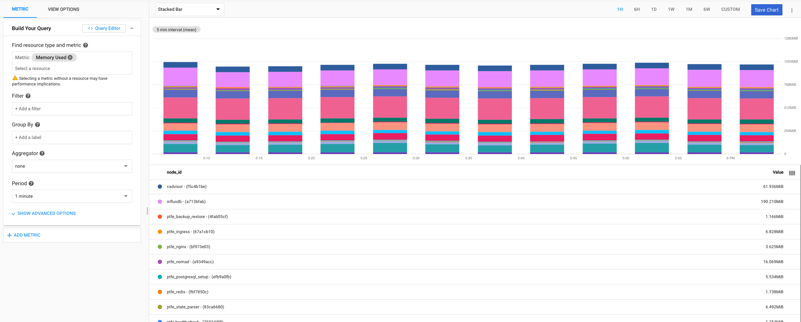
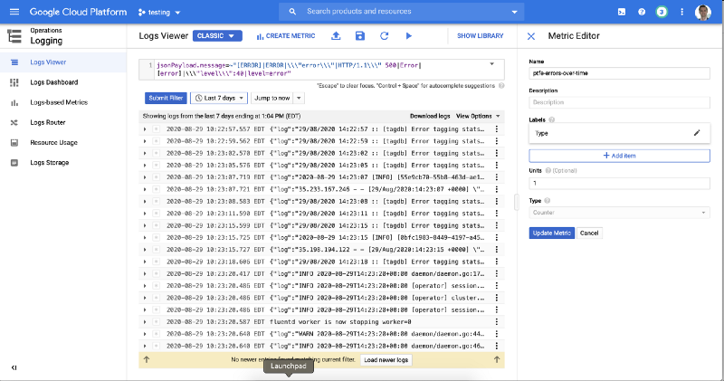
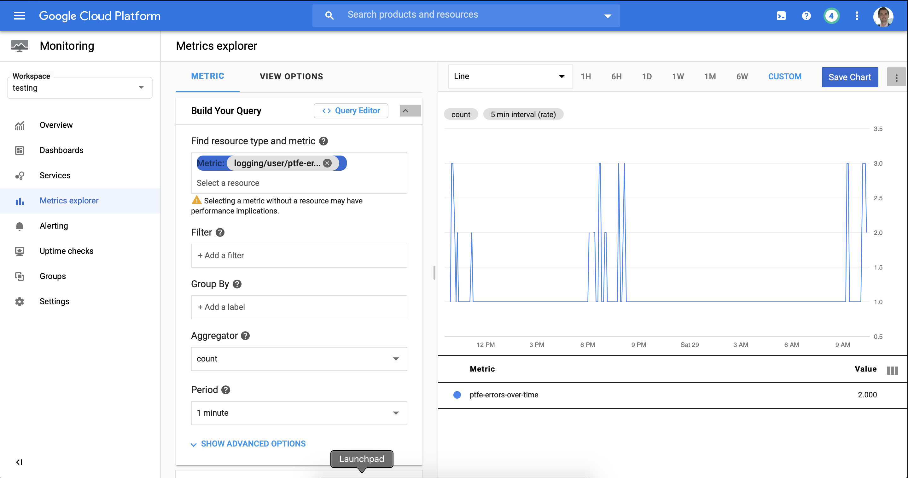
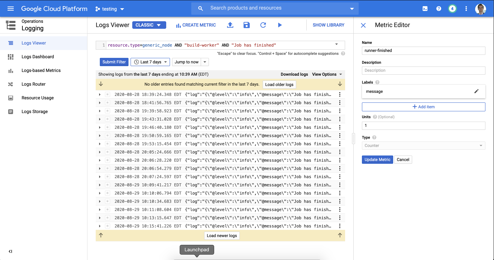
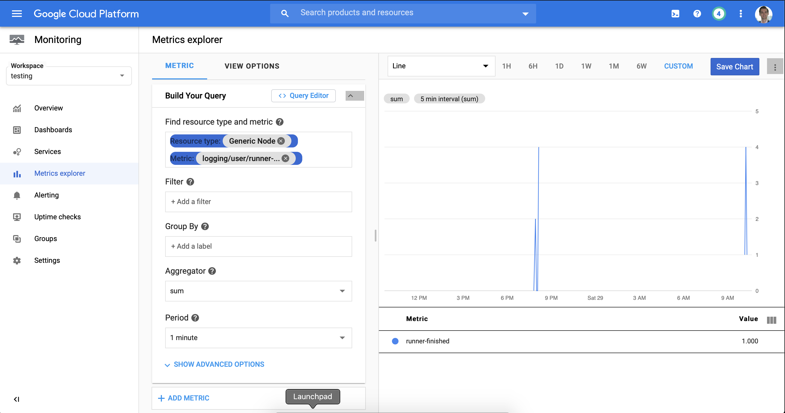
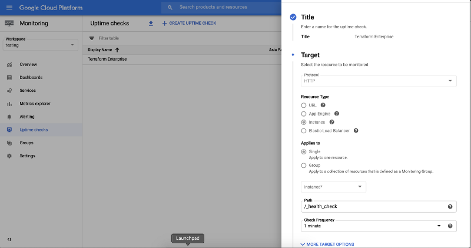
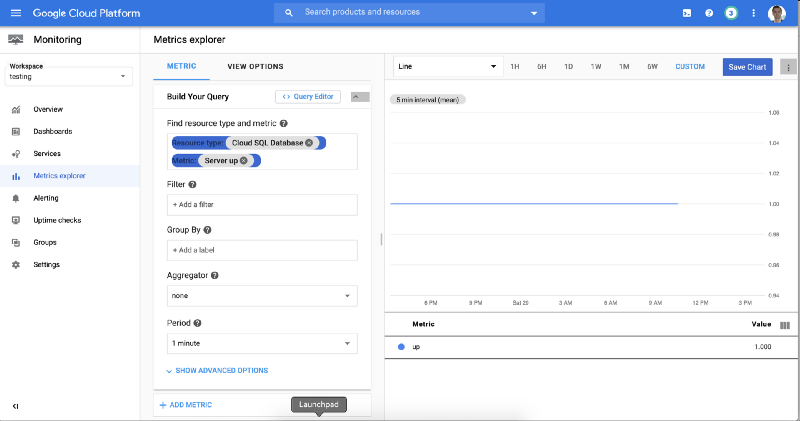

## BindPlane Collector

Following the instructions from GCP and BlueMedora on setting up the Collector and Destination components of BindPlane. The BindPlane Collector has four components.

1. Host Agent (Installed on the TFE Host)
2. Collector (Separate Instance that Sends Metrics to GCP Operations)
3. Logging Agent (Installed on the TFE Host)
4. CAdvisor: CAdvisor is a Docker container that runs on the TFE Host and exposes the Docker metrics via port 8080. This is what the Metric agent monitors and reports back to its collector.

BindPlane Configuration: https://cloud.google.com/monitoring/agent/plugins/bindplane-transition
CAdvisor Configuration: https://docs.bindplane.bluemedora.com/docs/docker


## BindPlane Universal Agent

The BindPlane Universal Agent is currently in beta which means that you'll need to request access to the feature. Once you've been granted access, you should see a new section within the UI that will allow you to configure an agent on your TFE host.

### Container CPU (Stacked Area Chart)



The Universal BindPlane Agent collects the CPU percentage per container out of the box. As a result, we can utilize the Metrics Explorer to search for the metric below and utilize the default line chart generated.

```
external.googleapis.com/bluemedora/generic_node/docker/container/cpu/total_utilization
```

### Container RAM (Stacked Bar Chart)



The Container RAM chart is almost identical to the CPU chart, except that we are going to utilize the BindPlane metric below whcih represents the RAM usage by all the containers running.

```
external.googleapis.com/bluemedora/generic_node/docker/container/memory/used
```

### Errors over time (Line Chart)



The Errors Over Time Chart filters our log entries for all the possible error log levels reported across the various TFE containers. Utilize the filter below to create a custom metric called `tfe-errors-over-time`.

```
jsonPayload.message=~"[ERROR]|ERROR|\\\"error\\\"|HTTP/1.1\\\" 500|Error|[error]|\\\"level\\\":40|level=error"
```



Utilize the Metrics Explorer to create a simple line chart based on our custom metrics.


### Number of Finished Workers (Line Chart)



The Number of Finished Workers metric is based the number Job Finished log entries that are detected from "build-worker" containers. Utilize the filter below to create a custom metric called runners-finished.

```
resource.type=generic_node AND "build-worker" AND "Job has finished"
```



Utilize the Metrics Explorer to create a simple line chart based on our custom metrics.


### Terraform Healthcheck



Terraform includes a basic health check endpoint that returns a 200 OK status code if TFE is healthy. As a result, we can utilize GCP's Uptime Check to set up a corresponding HTTP Health Check that will poll TFE's health check endpoint on a specified frequency. The link below includes how to configure an Uptime Check, enter the URL below, and adjust the frequency to match your requirements.

https://cloud.google.com/monitoring/uptime-checks

```
https://www.terraform_hostname_here.com/_health_check
```

### Cloud SQL Availability



CloudSQL provides a built-in availability metric, which makes it pretty straight forward to configure. Head over to the Metrics Explorer and filter by the "Cloud SQL Database" resource type and then select the "Server up" metric. This provides a simple counter metric that defines the service as either up or down.