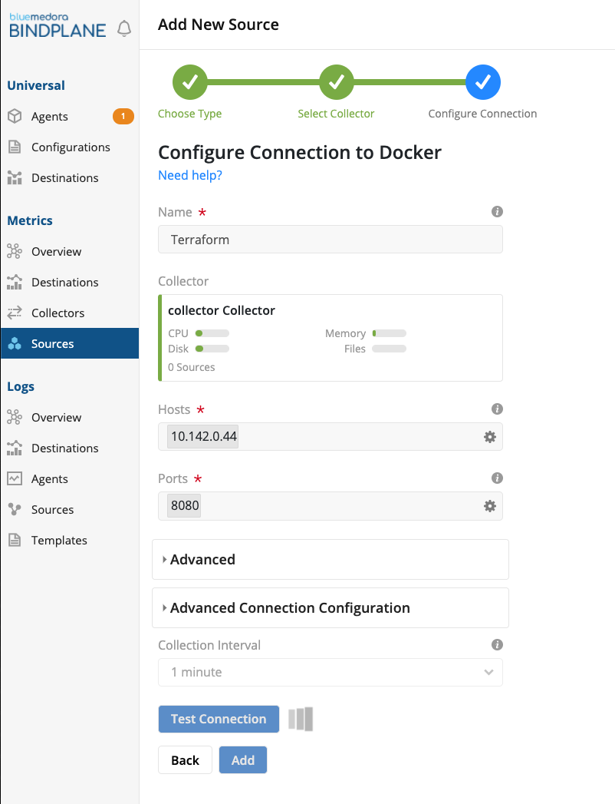

## Stackdriver Agent


## BindPlane Collector

Following the instructions from GCP and BlueMedora on setting up the Collector and Destination components of BindPlane.

https://cloud.google.com/blog/products/management-tools/extending-stackdriver-to-on-prem-with-the-newbindplane-integration





## BindPlane Universal Agent


export GOOGLE_PROJECT="testing-268014"
export GOOGLE_CREDENTIALS="../credentials/gcp.json"


### Container CPU (Stacked Area Chart)

The Container CPU chart creates a time series dataset using the average CPU percentage over three hours and a twenty-minute interval. 

```
external.googleapis.com/bluemedora/generic_node/docker/container/cpu/total_utilization
```

### Container RAM (Stacked Bar Chart)

The Container RAM chart almost identical to the CPU chart, except that we utilize the Memory Usage metric. If you customize this query, ensure that you set these to the same period and interval so that the charts represent the same set of events.

```
external.googleapis.com/bluemedora/generic_node/docker/container/memory/used
```


- Host CPU
- Host Memory
- Host Disk
- Containers CPU
- Containers RAM
- Errors over time
- Number of Active Workers
- Terraform Healthcheck
- SQL Healthcheck
- Blob Storage Healthcheck
- Vault Healthcheck (Optional)

docker run \
--restart=always  \
--privileged=true \
--volume=/cgroup:/cgroup:ro \
--volume=/:/rootfs:ro \
--volume=/var/run:/var/run:rw \
--volume=/sys:/sys:ro \
--volume=/var/lib/docker/:/var/lib/docker:ro \
--publish=8080:8080 \
--detach=true \
--name=cadvisor \
gcr.io/google-containers/cadvisor:latest


sudo useradd stackdriver-agent
sudo usermod -aG docker stackdriver-agent


LoadPlugin exec
<Plugin exec>
    Exec "stackdriver-agent:docker" "/opt/stackdriver/collectd/etc/collectd.d/test.sh"
</Plugin>


LoadPlugin match_regex
LoadPlugin target_set
LoadPlugin target_replace


<Chain "PreCache">

  # The following rule does all the work for your metric:
  <Rule "rewrite_curl_json_my_special_metric">
    # Do a careful match for just your metrics; if it fails, drop down
    # to the next rule:
    <Match regex>
      Plugin "^exec$"                   # Match on plugin.
      PluginInstance "^docker.*$" # Match on plugin instance.
      Type "^gauge$"                         # Match on type.
      TypeInstance "^cpu$"    # Match on type instance.
    </Match>

    <Target "set">
      # Specify the metric descriptor name:
      MetaData "stackdriver_metric_type" "custom.googleapis.com/terraform-machine/docker/${type_instance}/cpu"
      # Specify a value for the "service_name" label; clean it up in the next Target:
      MetaData "label:container_name" "%{type_instance}"
    </Target>

    <Target "replace">
      MetaData "stackdriver_metric_type" "cpu_" ""

      # Remove the "nginx_" prefix in the service_name to get the real service name:
      MetaData "label:container_name" "cpu_" ""
    </Target>
  </Rule>
</Chain>